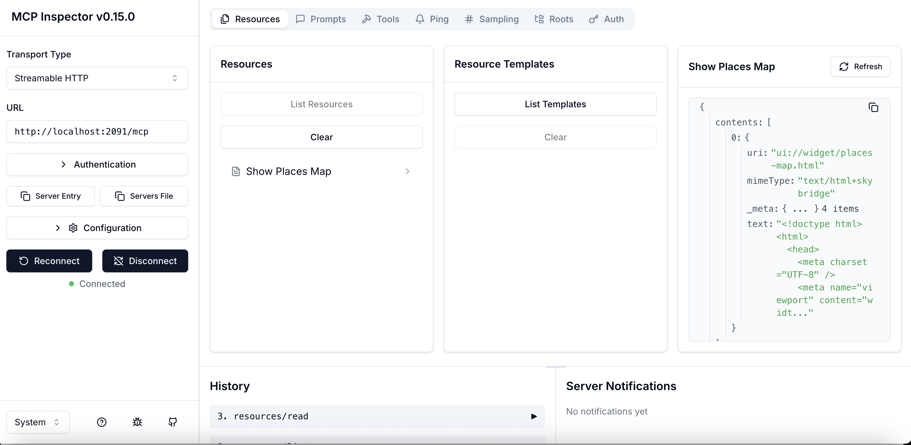
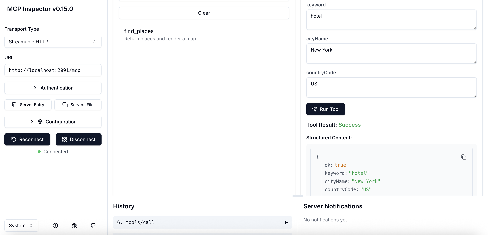
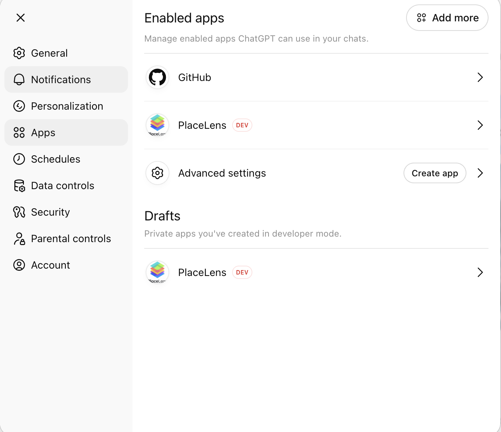
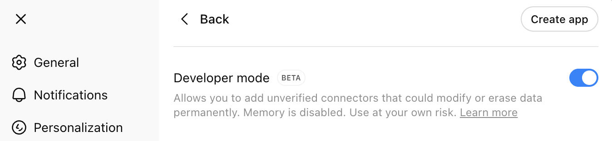
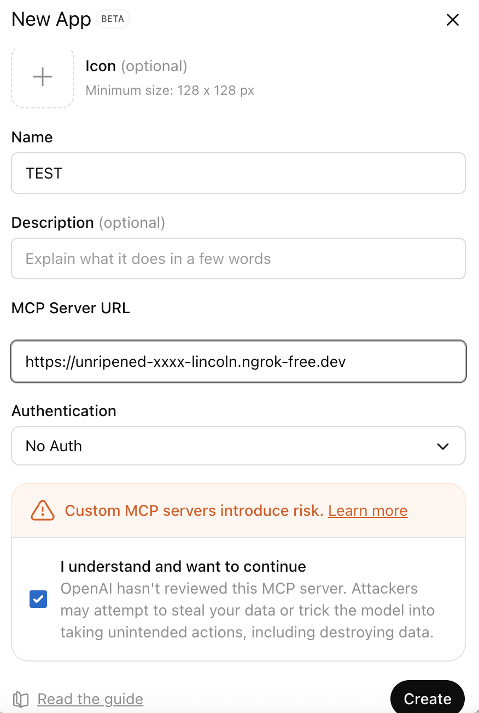

# How To Create a ChatGPT App with UI in ReactJS + Tailwind

<p align="center">
  
</p>

### Step-by-Step Guide (ChatGPT + MCP + Map UI)

In this tutorial, you’ll build a **ChatGPT App with a custom UI**, powered by:

* **React + Tailwind CSS** for the frontend
* **Mapbox GL** for map visualization
* **MCP (Model Context Protocol)** for tool execution
* A **Python MCP server** with a single tool: `find_places()`

When a user sends a prompt like:

> **“Show me some hotels in New York”**

ChatGPT will:

1. Call your MCP tool with structured input
2. Receive place data
3. Render a **live Map UI inside ChatGPT**, showing the results

### Example tool input

```json
{
  "keyword": "hotels",
  "cityName": "New York",
  "countryCode": "US"
}
```

### Example returned data

```json
{
  "title": "La Quinta Inn & Suites by Wyndham New York City Central Park",
  "subTitle": null,
  "description": [],
  "price": null,
  "address": "31 W 71st St, New York, NY 10023, United States",
  "neighborhood": "Manhattan",
  "street": "31 W 71st St",
  "city": "New York",
  "postalCode": "10023",
  "state": "New York",
  "countryCode": "US",
  "website": null,
  "phone": "+1 212-791-9451",
  "phoneUnformatted": "+12127919451",
  "location": {
    "lat": 40.776171,
    "lng": -73.9776917
  },
  "timeZone": "America/New_York",
  "openingHours": [],
}
```

> 📌 **Data source:**
> We fetch location data using Apify Actor:
> [Free Google Maps Scraper - Low-cost & Extensive Version](https://apify.com/blueorion/free-google-maps-scraper-extensive)

---

## Table of Contents

- [How To Create a ChatGPT App with UI in ReactJS + Tailwind](#how-to-create-a-chatgpt-app-with-ui-in-reactjs--tailwind)
  * [Table of Contents](#table-of-contents)
  * [Prerequisites](#prerequisites)
  * [Project Setup](#project-setup)
  * [Build the React + Tailwind UI](#build-the-react--tailwind-ui)
    + [Initialize React with Vite](#initialize-react-with-vite)
    + [Install Tailwind CSS](#install-tailwind-css)
  * [Configure Vite as a Multi-Page App (MPA)](#configure-vite-as-a-multi-page-app-mpa)
    + [Cleanup default Vite files](#cleanup-default-vite-files)
    + [Update `package.json` dependencies](#update-packagejson-dependencies)
    + [Configure Tailwind](#configure-tailwind)
    + [Configure Vite for ChatGPT-Compatible Output](#configure-vite-for-chatgpt-compatible-output)
  * [Add Shared Types and Hooks](#add-shared-types-and-hooks)
    + [`src/types.ts`](#srctypests)
    + [`src/index.css`](#srcindexcss)
    + [Hooks](#hooks)
  * [Create the Places Map UI Page](#create-the-places-map-ui-page)
    + [HTML entry point](#html-entry-point)
    + [React page logic](#react-page-logic)
  * [Build and Serve the UI](#build-and-serve-the-ui)
  * [Build the MCP Server (Python)](#build-the-mcp-server-python)
    + [Key MCP Concepts (Quick Explanation)](#key-mcp-concepts-quick-explanation)
    + [Run the MCP Server](#run-the-mcp-server)
  * [Test with MCP Inspector](#test-with-mcp-inspector)
  * [Connect MCP to ChatGPT](#connect-mcp-to-chatgpt)
    + [Expose MCP via ngrok](#expose-mcp-via-ngrok)
    + [Create the ChatGPT App](#create-the-chatgpt-app)
    
---

## Prerequisites

Make sure the following tools are installed:

* `git`
* `npm` or `pnpm`
* **Python 3.10+** (for MCP server)
* `uv` (recommended for Python environment management)

---

## Project Setup

Create a new workspace for the tutorial:

```
mkdir chatgpt-app-tutorial
cd chatgpt-app-tutorial
git init
```

You’ll be working in **two main parts**:

1. `ui-js/` → React + Tailwind UI
2. `mcp_server/` → Python MCP backend

---

## Build the React + Tailwind UI

> 💡 We’ll reuse UI patterns from **OpenAI Apps SDK Examples**
> This helps ensure compatibility with ChatGPT’s embedded renderer.

### Initialize React with Vite

```
npm create vite@latest ui-js -- --template react
```

Follow the on-screen prompts to finish setup.

---

### Install Tailwind CSS

Inside the `ui-js` folder:

```
npm install -D tailwindcss@3 postcss autoprefixer
npx tailwindcss init -p
```

Start the dev server to verify everything works:

```
npm run dev
```

You should see something like:

```
VITE v7.3.1 ready in 243 ms
Local: http://localhost:5173/
```

> Tip: Press **`o + Enter`** to open the browser automatically.

---

## Configure Vite as a Multi-Page App (MPA)

We want **each UI widget to be deployable independently**, meaning:

* Each page has its own HTML
* Each page has its own bundled JS/CSS
* ChatGPT can load the UI reliably via full URLs

### Cleanup default Vite files

* Remove everything inside `src/`
* Delete the `public/` folder
* Remove `src/index.html`

---

### Update `package.json` dependencies

Add the following (do not remove your existing scripts):

```json
"dependencies": {
  "@openai/apps-sdk-ui": "^0.2.1",
  "embla-carousel-react": "^8.6.0",
  "framer-motion": "^12.29.2",
  "lucide-react": "^0.563.0",
  "mapbox-gl": "^3.18.1",
  "react": "^19.2.0",
  "react-dom": "^19.2.0",
  "react-router-dom": "^7.13.0"
},
"devDependencies": {
  "@eslint/js": "^9.39.1",
  "@tailwindcss/vite": "^4.1.18",
  "@types/react": "^19.2.5",
  "@types/react-dom": "^19.2.3",
  "@vitejs/plugin-react": "^5.1.1",
  "babel-plugin-react-compiler": "^1.0.0",
  "eslint": "^9.39.1",
  "eslint-plugin-react-hooks": "^7.0.1",
  "eslint-plugin-react-refresh": "^0.4.24",
  "globals": "^16.5.0",
  "tailwindcss": "^4.1.18",
  "vite": "^7.2.4"
}
```

---

### Configure Tailwind

Update `tailwind.config.js`:

```js
export default {
  content: ["./index.html", "./**/*.html", "./src/**/*.{js,jsx,ts,tsx}"],
  theme: { extend: {} },
  plugins: [],
};
```

---

### Configure Vite for ChatGPT-Compatible Output

Update `vite.config.js` exactly as follows:

```js
import { defineConfig } from "vite";
import react from "@vitejs/plugin-react";
import { resolve } from "path";
import tailwindcss from "@tailwindcss/vite";

export default defineConfig({
  base: "http://localhost:5173/",
  plugins: [react({
      babel: {
        plugins: [['babel-plugin-react-compiler']],
      },
    }), tailwindcss()],
  build: {
    cssCodeSplit: false,
    rollupOptions: {
      input: {
        "places-map": resolve(__dirname, "places-map/index.html"),
      },
      output: {
        manualChunks: undefined,
        entryFileNames: ({ name }) => `${name}/assets/[name].js`,
        // Put *all* chunks (if any) alongside the entry that imports them.
        // With manualChunks undefined, you should get very few chunks.
        chunkFileNames: ({ facadeModuleId }) => {
          // try to infer the page from where the chunk comes from
          const id = (facadeModuleId || "").replace(/\\/g, "/");
          const m = id.match(/\/src\/pages\/([^/]+)\//); // src/pages/<page>/
          const page = m?.[1] || "places-map"; // fallback
          return `${page}/assets/[name].js`;
        },

        // Put assets under the inferred page folder too
        assetFileNames: (assetInfo) => {
          const name = assetInfo.name?.replace(/\\/g, "/") || "";
          const m = name.match(/src\/pages\/([^/]+)\//);
          const page = m?.[1] || "places-map";
          return `${page}/assets/[name][extname]`;
        },
      }
    },
  },
});
```

> ⚠️ **Important**
> ChatGPT **requires absolute URLs** for assets.
> Relative paths like `assets/app.js` will NOT render correctly.

Your final `dist` output should look like:

```
dist/
└── places-map/
    ├── index.html
    └── assets/
```

And `index.html` must include full URLs such as:

```html
<script src="http://localhost:5173/places-map/assets/places-map.js"></script>
```

---

## Add Shared Types and Hooks

These files handle communication between:

* ChatGPT host
* UI widget
* MCP tool state

### `src/types.ts`

```ts
export type OpenAiGlobals<
  ToolInput = UnknownObject,
  ToolOutput = UnknownObject,
  ToolResponseMetadata = UnknownObject,
  WidgetState = UnknownObject
> = {
  // visuals
  theme: Theme;

  userAgent: UserAgent;
  locale: string;

  // layout
  maxHeight: number;
  displayMode: DisplayMode;
  safeArea: SafeArea;

  // state
  toolInput: ToolInput;
  toolOutput: ToolOutput | null;
  toolResponseMetadata: ToolResponseMetadata | null;
  widgetState: WidgetState | null;
  setWidgetState: (state: WidgetState) => Promise<void>;
};

// currently copied from types.ts in chatgpt/web-sandbox.
// Will eventually use a public package.
type API = {
  callTool: CallTool;
  sendFollowUpMessage: (args: { prompt: string }) => Promise<void>;
  openExternal(payload: { href: string }): void;

  // Layout controls
  requestDisplayMode: RequestDisplayMode;
  requestModal: (args: { title?: string; params?: UnknownObject }) => Promise<unknown>;
  requestClose: () => Promise<void>;
};

export type UnknownObject = Record<string, unknown>;

export type Theme = "light" | "dark";

export type SafeAreaInsets = {
  top: number;
  bottom: number;
  left: number;
  right: number;
};

export type SafeArea = {
  insets: SafeAreaInsets;
};

export type DeviceType = "mobile" | "tablet" | "desktop" | "unknown";

export type UserAgent = {
  device: { type: DeviceType };
  capabilities: {
    hover: boolean;
    touch: boolean;
  };
};

/** Display mode */
export type DisplayMode = "pip" | "inline" | "fullscreen";
export type RequestDisplayMode = (args: { mode: DisplayMode }) => Promise<{
  /**
   * The granted display mode. The host may reject the request.
   * For mobile, PiP is always coerced to fullscreen.
   */
  mode: DisplayMode;
}>;

export type CallToolResponse = {
  result: string;
};

/** Calling APIs */
export type CallTool = (
  name: string,
  args: Record<string, unknown>
) => Promise<CallToolResponse>;

/** Extra events */
export const SET_GLOBALS_EVENT_TYPE = "openai:set_globals";
export class SetGlobalsEvent extends CustomEvent<{
  globals: Partial<OpenAiGlobals>;
}> {
  readonly type = SET_GLOBALS_EVENT_TYPE;
}

/**
 * Global oai object injected by the web sandbox for communicating with chatgpt host page.
 */
declare global {
  interface Window {
    openai: API & OpenAiGlobals;
  }

  interface WindowEventMap {
    [SET_GLOBALS_EVENT_TYPE]: SetGlobalsEvent;
  }
}
```

### `src/index.css`

This enables:

* Tailwind CSS
* OpenAI UI styling
* Scrollbar compatibility inside ChatGPT

```css
@import "tailwindcss";
@import "@openai/apps-sdk-ui/css";
@source "../node_modules/@openai/apps-sdk-ui";
@source ".";

@layer utilities {
  .overflow-auto > *,
  .overflow-scroll > *,
  .overflow-x-auto > *,
  .overflow-y-auto > * {
    scrollbar-color: auto;
  }

  /* Base style for scrollable elements */
  .overflow-auto,
  .overflow-scroll,
  .overflow-x-auto,
  .overflow-y-auto,
  .overflow-x-scroll,
  .overflow-y-scroll {
    scrollbar-color: rgb(0, 0, 0, 0.1) transparent;

    @media (prefers-color-scheme: dark) {
      scrollbar-color: rgb(255, 255, 255, 0.1) transparent;
    }
  }

  /* Hover state directly on the scrollable element */
  .overflow-auto:hover,
  .overflow-scroll:hover,
  .overflow-x-auto:hover,
  .overflow-y-auto:hover {
    scrollbar-color: rgb(0, 0, 0, 0.2) transparent;

    @media (prefers-color-scheme: dark) {
      scrollbar-color: rgb(255, 255, 255, 0.2) transparent;
    }
  }
}
```

### Hooks

* `use-max-height.ts`

```js
import { useOpenAiGlobal } from "./use-openai-global";

export const useMaxHeight = (): number | null => {
  return useOpenAiGlobal("maxHeight");
};

```

* `use-openai-global.ts`

```js
import { useSyncExternalStore } from "react";
import {
  SET_GLOBALS_EVENT_TYPE,
  SetGlobalsEvent,
  type OpenAiGlobals,
} from "../types";

export function useOpenAiGlobal<K extends keyof OpenAiGlobals>(
  key: K
): OpenAiGlobals[K] | null {
  return useSyncExternalStore(
    (onChange) => {
      if (typeof window === "undefined") {
        return () => {};
      }

      const handleSetGlobal = (event: SetGlobalsEvent) => {
        const value = event.detail.globals[key];
        if (value === undefined) {
          return;
        }

        onChange();
      };

      window.addEventListener(SET_GLOBALS_EVENT_TYPE, handleSetGlobal, {
        passive: true,
      });

      return () => {
        window.removeEventListener(SET_GLOBALS_EVENT_TYPE, handleSetGlobal);
      };
    },
    () => window.openai?.[key] ?? null,
    () => window.openai?.[key] ?? null
  );
}
```

These hooks allow the widget to:

* Respect ChatGPT layout constraints
* React to global UI changes

---

## Create the Places Map UI Page

To add a new UI widget:

1. Create an HTML entry
2. Create a matching React page

### HTML entry point


`src/places-map/index.html`

```html
<!doctype html>
<html>
  <head>
    <meta charset="UTF-8" />
    <meta name="viewport" content="width=device-width, initial-scale=1.0" />
    <title>Place Map</title>
  </head>
  <body>
    <div id="root"></div>
    <script type="module" src="/src/pages/places-map/main.tsx"></script>
  </body>
</html>
```

This is the file ChatGPT loads directly.

### React page logic

`src/pages/places-map/`

There are 5 files in this folder and they are big too post here but you can copy from this repo. The main thing you should aware of is `const toolOutput = useOpenAiGlobal("toolOutput");` which fetch tool output from OpenAI Global and use in the UI. This usually takes couple of seconds to load.

> You can repeat this structure to create **multiple ChatGPT widgets**.

---

## Build and Serve the UI

Install dependencies:

```
npm install
```

Run a local dev preview:

```
npm run dev
```

When ready, build for production:

```
npm run build
```

Serve the final output:

```
npm i -g serve
serve dist -p 5173
```

Verify in browser:

```
http://localhost:5173/places-map/
```

---

## Build the MCP Server (Python)

Now we connect ChatGPT → Tool → UI.

Create the MCP folder:

```
mkdir mcp_server
```

This server will:

* Expose a single tool: `find_places`
* Return structured data
* Attach a UI widget to the response

---

### Key MCP Concepts (Quick Explanation)

* **Tool** → callable function (`find_places`)
* **Widget** → UI rendered in ChatGPT
* **Resource** → HTML template for the widget
* **Structured Content** → JSON passed to the UI

---

In this folder, create following files:

### `main.py`

This is the starting point where we start our mcp server, running locally on port **2091**

```py
from __future__ import annotations

from .mcp_app import app

if __name__ == "__main__":
    import uvicorn

    uvicorn.run("mcp_server.main:app", host="0.0.0.0", port=2091)
```

### `widgets.py`

```py
from __future__ import annotations

from dataclasses import dataclass
from functools import lru_cache
from pathlib import Path
from typing import Dict, List


MIME_TYPE = "text/html+skybridge"


@dataclass(frozen=True)
class Widget:
    identifier: str
    title: str
    template_uri: str
    invoking: str
    invoked: str
    html: str
    response_text: str


ASSETS_DIR = Path(__file__).resolve().parent / "../ui-js/dist"


@lru_cache(maxsize=None)
def load_widget_html(file_stem: str) -> str:
    html_path = ASSETS_DIR / f"{file_stem}/index.html"
    if html_path.exists():
        return html_path.read_text(encoding="utf8")
    raise FileNotFoundError(f'Widget HTML "{html_path}" not found.')


def build_widgets() -> List[Widget]:
    return [
        Widget(
            identifier="places-map",
            title="Show Places Map",
            template_uri="ui://widget/places-map.html",
            invoking="Preparing a map",
            invoked="Map ready",
            html=load_widget_html("places-map"),
            response_text="Rendered a places map!",
        )
    ]


def widgets_by_id(widgets: List[Widget]) -> Dict[str, Widget]:
    return {w.identifier: w for w in widgets}


def widgets_by_uri(widgets: List[Widget]) -> Dict[str, Widget]:
    return {w.template_uri: w for w in widgets}


def resource_description(widget: Widget) -> str:
    return f"{widget.title} widget markup"


def tool_meta(widget: Widget) -> dict:
    return {
        "openai/outputTemplate": widget.template_uri,
        "openai/toolInvocation/invoking": widget.invoking,
        "openai/toolInvocation/invoked": widget.invoked,
        "openai/widgetAccessible": True,
    }


def tool_invocation_meta(widget: Widget) -> dict:
    return {
        "openai/toolInvocation/invoking": widget.invoking,
        "openai/toolInvocation/invoked": widget.invoked,
    }

```
*Note:*
- `ASSETS_DIR = Path(__file__).resolve().parent / "../ui-js/dist"` is where we build the UI later on
- `def build_widgets() -> List[Widget]:` You define all your UI widgets here to display on ChatGPT chat message box in the response to user prompt.
- The actual HTML file which will be sent to the response is in `def load_widget_html(file_stem: str) -> str:`, in our example, the exact location will be `ui-js/dist/places-map/index.html`


### `security.py`

```py
from __future__ import annotations

import os
from typing import List
from mcp.server.transport_security import TransportSecuritySettings


def _split_env_list(value: str | None) -> List[str]:
    if not value:
        return []
    return [item.strip() for item in value.split(",") if item.strip()]


def transport_security_settings() -> TransportSecuritySettings:
    allowed_hosts = _split_env_list(os.getenv("MCP_ALLOWED_HOSTS"))
    allowed_origins = _split_env_list(os.getenv("MCP_ALLOWED_ORIGINS"))
    if not allowed_hosts and not allowed_origins:
        return TransportSecuritySettings(enable_dns_rebinding_protection=False)
    return TransportSecuritySettings(
        enable_dns_rebinding_protection=True,
        allowed_hosts=allowed_hosts,
        allowed_origins=allowed_origins,
    )
```
*Note:* We can define the `MCP_ALLOWED_HOSTS` and `MCP_ALLOWED_ORIGINS` in `.env` during production but not required in this tutorial

### `schemas.py`

```py
from __future__ import annotations

from typing import Optional, Any, Dict
from pydantic import BaseModel, ConfigDict, Field


class FindPlaceUsingKwInput(BaseModel):
    keyword: str
    cityName: str
    countryCode: str

    model_config = ConfigDict(populate_by_name=True, extra="forbid")


FIND_BY_KW_SCHEMA: Dict[str, Any] = {
    "type": "object",
    "properties": {
        "keyword": {"type": "string"},
        "cityName": {"type": "string"},
        "countryCode": {"type": "string"},
    },
    "required": ["keyword", "cityName", "countryCode"],
    "additionalProperties": False,
}
```
*Note:* We are using `pydantic` to validate input data

### `utils.py`

```py
from __future__ import annotations

import json
from typing import Any, Dict, List
import os


BASE_DIR = os.path.dirname(os.path.abspath(__file__))
PLACES_DIR = os.path.join(BASE_DIR, "data", "places")

def _load_all_places() -> List[Dict[str, Any]]:
    """Load all JSON files from ./data/places"""
    places: List[Dict[str, Any]] = []

    if not os.path.isdir(PLACES_DIR):
        raise FileNotFoundError(f"Directory not found: {PLACES_DIR}")

    for filename in os.listdir(PLACES_DIR):
        if not filename.endswith(".json"):
            continue

        path = os.path.join(PLACES_DIR, filename)
        try:
            with open(path, "r", encoding="utf-8") as f:
                places.append(json.load(f))
        except Exception as e:
            print(f"⚠️ Failed to load {filename}: {e}")

    return places
```

### `mcp_app.py`

This .py file is how we prepare the data to response ChatGPT request. We have only 1 tool and listed in `@mcp._mcp_server.list_tools()`

The actual code for the tool is in `async def _call_tool_request(req: types.CallToolRequest) -> types.ServerResult:` where we will load all json files from `./data/places/` as a List.

```py
from __future__ import annotations

import random
from copy import deepcopy
from typing import List

import mcp.types as types
from mcp.server.fastmcp import FastMCP
from pydantic import ValidationError

from .utils import _load_all_places
from .schemas import (
    FindPlaceUsingKwInput,
    FIND_BY_KW_SCHEMA,
)
from .security import transport_security_settings
from .widgets import (
    MIME_TYPE,
    build_widgets,
    widgets_by_id,
    widgets_by_uri,
    resource_description,
    tool_meta,
    tool_invocation_meta,
)

# Build widgets once
WIDGETS = build_widgets()
WIDGETS_BY_ID = widgets_by_id(WIDGETS)
WIDGETS_BY_URI = widgets_by_uri(WIDGETS)

# One widget shared by both tools
MAP_WIDGET = WIDGETS_BY_ID["places-map"]


mcp = FastMCP(
    name="places-python",
    stateless_http=True,
    transport_security=transport_security_settings(),
)


@mcp._mcp_server.list_tools()
async def _list_tools() -> List[types.Tool]:
    return [
        types.Tool(
            name="find_places",
            title="Find places using keyword",
            description="Return places and render a map.",
            inputSchema=deepcopy(FIND_BY_KW_SCHEMA),
            _meta=tool_meta(MAP_WIDGET),
            annotations={
                "destructiveHint": False,
                "openWorldHint": False,
                "readOnlyHint": True,
            },
        ),
    ]


@mcp._mcp_server.list_resources()
async def _list_resources() -> List[types.Resource]:
    return [
        types.Resource(
            name=w.title,
            title=w.title,
            uri=w.template_uri,
            description=resource_description(w),
            mimeType=MIME_TYPE,
            _meta=tool_meta(w),
        )
        for w in WIDGETS
    ]


@mcp._mcp_server.list_resource_templates()
async def _list_resource_templates() -> List[types.ResourceTemplate]:
    return [
        types.ResourceTemplate(
            name=w.title,
            title=w.title,
            uriTemplate=w.template_uri,
            description=resource_description(w),
            mimeType=MIME_TYPE,
            _meta=tool_meta(w),
        )
        for w in WIDGETS
    ]


async def _handle_read_resource(req: types.ReadResourceRequest) -> types.ServerResult:
    widget = WIDGETS_BY_URI.get(str(req.params.uri))
    if widget is None:
        return types.ServerResult(
            types.ReadResourceResult(
                contents=[],
                _meta={"error": f"Unknown resource: {req.params.uri}"},
            )
        )

    contents = [
        types.TextResourceContents(
            uri=widget.template_uri,
            mimeType=MIME_TYPE,
            text=widget.html,
            _meta=tool_meta(widget),
        )
    ]
    return types.ServerResult(types.ReadResourceResult(contents=contents))


async def _call_tool_request(req: types.CallToolRequest) -> types.ServerResult:
    tool_name = req.params.name
    args = req.params.arguments or {}
    meta = tool_invocation_meta(MAP_WIDGET)

    if tool_name == "find_places":
        try:
            payload = FindPlaceUsingKwInput.model_validate(args)
        except ValidationError as exc:
            return types.ServerResult(
                types.CallToolResult(
                    content=[types.TextContent(type="text", text=f"Input validation error: {exc.errors()}")],
                    isError=True,
                )
            )

        places = _load_all_places()
        return types.ServerResult(
            types.CallToolResult(
                content=[types.TextContent(type="text", text=MAP_WIDGET.response_text)],
                structuredContent={
                    "ok": True,
                    "keyword": payload.keyword,
                    "cityName": payload.cityName,
                    "countryCode": payload.countryCode,
                    "count": len(places),
                    "places": places,
                },
                _meta=meta,
            )
        )

    return types.ServerResult(
        types.CallToolResult(
            content=[types.TextContent(type="text", text=f"Unknown tool: {tool_name}")],
            isError=True,
        )
    )


# Wire handlers
mcp._mcp_server.request_handlers[types.CallToolRequest] = _call_tool_request
mcp._mcp_server.request_handlers[types.ReadResourceRequest] = _handle_read_resource


# Export ASGI app
app = mcp.streamable_http_app()

# Optional: CORS
try:
    from starlette.middleware.cors import CORSMiddleware

    app.add_middleware(
        CORSMiddleware,
        allow_origins=["*"],
        allow_methods=["*"],
        allow_headers=["*"],
        allow_credentials=False,
    )
except Exception:
    pass

```

---

### Run the MCP Server

Create and activate a virtual environment:

```
python -m venv .venv
source .venv/bin/activate
pip install -r requirements.txt
```

Start the server:

```
uvicorn mcp_server.main:app --host 0.0.0.0 --port 2091
```

You should see:

```
Uvicorn running on http://0.0.0.0:2091
```

---

## Test with MCP Inspector

In a new terminal:

```
npx @modelcontextprotocol/inspector
```

Open the provided URL to:

* List tools
* Call `find_places`
* Inspect structured responses





---

## Connect MCP to ChatGPT

### Expose MCP via ngrok

```
ngrok http 2091
```

Copy the generated HTTPS URL.

---

### Create the ChatGPT App

1. Open **ChatGPT Settings**
2. Enable **Developer Mode**
3. Click **Create App**
4. Paste ngrok URL
5. Select **No Auth**
6. Save as Draft







Now, when you prompt:

> “Show me some hotels in New York”

🎉 ChatGPT will:

* Call your MCP tool (find_places)
* Load your React UI
* Render the map inline with the output from MCP Tool

### Buy me a coffee ☕
> 👉 https://paypal.me/nad128668
> 👉 0x80b3c3aac362Fcb2CFD7a381637f6A5dFE903146 (Any EVM-Based Asset)

### Contributing
You are welcome to open issues or submit PRs to improve this app.

### License
This project is licensed under the MIT License. See LICENSE for details.
